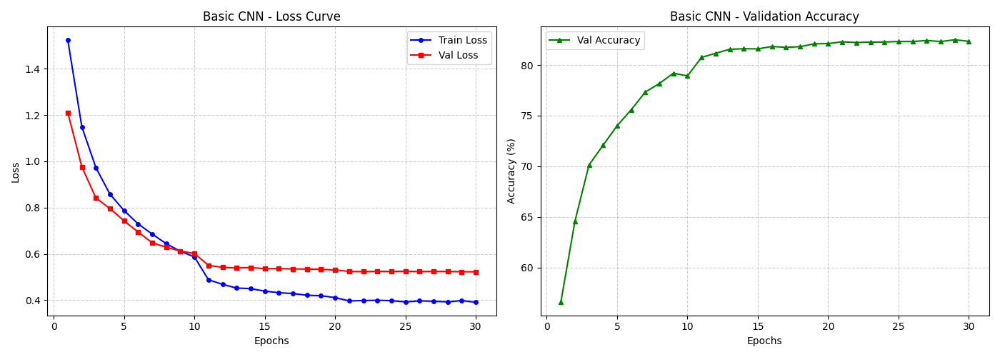
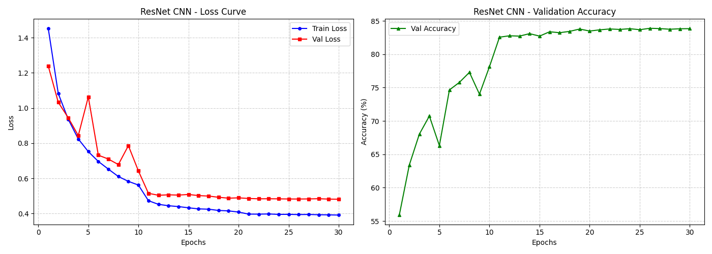

# Building a CNN on CIFAR-10 with PyTorch 


A comprehensive PyTorch implementation and hardware performance analysis of Convolutional Neural Networks (CNNs) on the CIFAR-10 dataset. 

This repository goes beyond standard model training. It features a deep dive into **Receptive Fields**, **FLOPs vs. Latency**, and a detailed comparative analysis between a traditional Basic CNN and a ResNet architecture regarding parameter efficiency and hardware resource utilization.

## Table of Contents
- [Project Overview](#-project-overview)
- [Key Features](#-key-features)
- [Repository Structure](#-repository-structure)
- [Installation & Setup](#-installation--setup)
- [Usage](#-usage)
- [Experimental Results](#-experimental-results)
- [Performance Analysis & Insights](#-performance-analysis--insights)
- [Documentation](#-documentation)

---

## Project Overview

This project implements two different CNN architectures from scratch to classify the CIFAR-10 dataset (60,000 32x32 color images in 10 classes):
1. **Basic CNN:** A traditional VGG-style sequential network (Conv -> ReLU -> MaxPool -> FC).
2. **ResNet CNN:** A modern architecture utilizing Residual Blocks, Batch Normalization, and Global Average Pooling (GAP).

The goal is not only to achieve good accuracy but to understand the *trade-offs* between model size, computational complexity (FLOPs), and actual inference hardware latency/memory footprint.

## Key Features

- **End-to-End PyTorch Pipeline:** Data augmentation, training loop, LR scheduling (StepLR), and evaluation.
- **Detailed Shape Tracing:** Layer-by-layer tensor shape and Receptive Field calculations.
- **Hardware Profiling:** Utilizes `torchinfo` and CUDA synchronization to measure real-world performance metrics.
- **Deep Insights:** Empirical proof demonstrating why fewer parameters/FLOPs do *not* always guarantee faster latency or lower memory usage.

## Repository Structure

```text
.
├── docs/
│   └── CNN_on_CIFAR-10_Presentation.pdf   # Detailed slide deck with architecture trace and analysis
├── image/                                 # Training metrics and performance screenshots
│   ├── Basic_CNN_metrics.png
│   ├── ResNet_CNN_metrics.png
│   └── ...
├── model/                                 # Saved weights for best performing models (.pth)
├── src/
│   └── cnn_pytorch.py                     # Main source code (training, evaluation, profiling)
├── .gitignore
├── requirements.txt                       # Python dependencies
└── README.md
```

## Installation & Setup

1. Clone this repository:
```bash
git clone https://github.com/Wzx0110/Building-a-CNN-on-CIFAR-10-with-PyTorch.git
cd Building-a-CNN-on-CIFAR-10-with-PyTorch
```

2. Create a virtual environment and install dependencies:
```bash
python -m venv venv
source venv/bin/activate  # On Windows use `venv\Scripts\activate`
pip install -r requirements.txt
```

*(Ensure you have CUDA installed if you want to run the GPU hardware profiling.)*

## Usage

To start the training process and hardware evaluation for both models, simply run:

```bash
python src/cnn_pytorch.py
```
This script will:
- Download the CIFAR-10 dataset.
- Train the Basic CNN and ResNet CNN for 30 epochs.
- Save the best weights in the `/model` directory.
- Generate and save accuracy/loss learning curves in the `/image` directory.
- Output a detailed hardware performance report in the console.

## Experimental Results

Both models were trained for 30 epochs using the Adam Optimizer and StepLR. Data augmentation (`RandomCrop`, `RandomHorizontalFlip`) was applied to prevent overfitting.

| Metric | Basic CNN | ResNet CNN |
| :--- | :---: | :---: |
| **Validation Accuracy** | **82.34%** | **83.84%** |
| **Model Size** | 16.38 MB | **1.11 MB** |
| **Total Parameters** | 4.29 M | **0.29 M** *(~93% reduction)* |

### Learning Curves

#### Basic CNN


#### ResNet CNN


## Performance Analysis & Insights

One of the main takeaways from this project is the discrepancy between theoretical efficiency and actual hardware performance. 

| Hardware Metric | Basic CNN | ResNet CNN | Observation |
| :--- | :--- | :--- | :--- |
| **FLOPs** | **0.014 GFLOPs** | 0.030 GFLOPs | ResNet has more FLOPs despite fewer parameters. |
| **Latency** (Batch=1) | **0.41 ms** | 0.83 ms | ResNet is slower in actual inference. |
| **Peak VRAM** | **24.86 MB** | 51.08 MB | ResNet consumes more memory during inference. |

### Key Takeaways:
1. **Architecture & Parameter Efficiency:** By replacing the massive Fully Connected layers with **Global Average Pooling (GAP)**, the ResNet architecture reduced the parameter count by **93%** while simultaneously increasing accuracy.
2. **FLOPs $\neq$ Latency:** Although ResNet has drastically fewer parameters, its Conv layers are deeper. Since Convolutional layers dominate computation (MACs) compared to FC layers, the overall FLOPs and inference latency are higher for ResNet.
3. **Memory Footprint Penalty of Skip Connections:** ResNet requires keeping historical Feature Maps in the GPU VRAM to compute the addition for Skip Connections. This results in a Peak Memory usage double that of the Basic CNN. 
   > **Conclusion:** *A smaller model size does not automatically equate to faster inference or lower memory consumption on edge devices.*

## Documentation
For a complete walkthrough of the layer-by-layer shape tracing, Receptive Field calculations, and step-by-step training loop implementation, please refer to the presentation slides:
[**CNN_on_CIFAR-10_Presentation.pdf**](./docs/CNN_on_CIFAR-10_Presentation.pdf)

```
